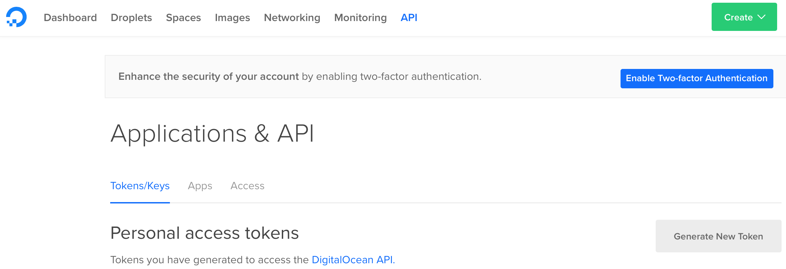
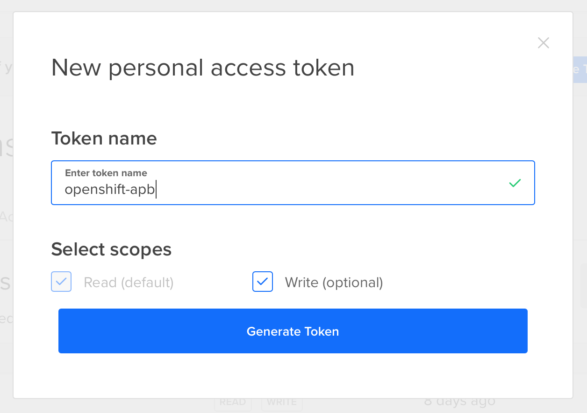
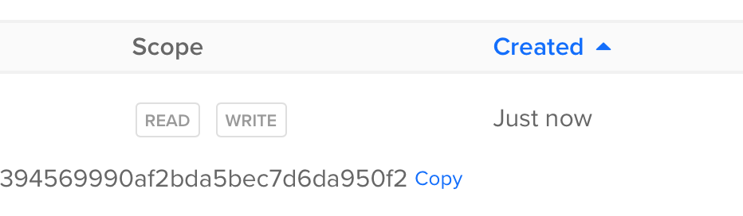

# MySQL on Digital Ocean Droplet APB


## Requirements

You will need following to get started.
1. Digital Ocean account and API key
2. Openshift Container Platform 3.7+ with admin access to openshift-ansible-service-broker namespace and oc cli tool.
3. OPTIONAL: docker and apb if you want to push apb to your Openshift's local registry. [VeerMuchandi](https://github.com/VeerMuchandi) has created nice gettings started guide about developing APBs https://github.com/VeerMuchandi/Using-OpenShift-APB

## Summary of what that playbook bundle does
1. Creates SSH key and loads it to Digital Ocean
2. Creates new CentOS based droplet and install MySQL in there
3. Creates random root password for MySQL
4. Creates new user with given name and password
5. Creates new database
6. Creates endpoint object that points to newly create droplet
7. Creates service object that uses created endpoint
8. Creates secret object that contains public and private keys that were created during provisioning.
9. Create service binding with credentials and that random root password.


## Create Digital Ocean API key

1. Log in to your Digital Ocean account. Create one if you dont have one. https://digitalocean.com
2. Once account is created and you are logged in, go to API sections. https://cloud.digitalocean.com/settings/api
3. Create new personal access token (images 1 and 2). You will need Read/Write scopes. Token name is irrelevant
4. After you generate new token it will be displayed to you with Copy link (image 3). Store that token somewhere safe for few minutes.







## Propare your Openshift

By default Ansible service broker is configured only to check playbook bundles from Openshift's internal container registry and from Red Hat Container Catalog (rhcc).

You can add new source for APBs by modifying ansible-service-borker (asb) configuration. asb configurations is stored in config map named broker-config

```
$ oc get configmap -n openshift-ansible-service-broker
NAME            DATA      AGE
broker-config   1         6d
```

You can edit from web console or with `oc edit` command. You need to add following item under registry key.

```
- name: dh
  type: dockerhub
  org: tpahonen
  white_list:
  - ".*-apb$"
```

With above configuration asb will read all images from my DockerHub account and process all images ending -apb. Only image matching white list is https://github.com/tahonen/mysql-digital-ocean-apb.

Final configuration should look something like this.

```
broker:
  auth:
  - {enabled: false, type: basic}
  auto_escalate: false
  bootstrap_on_startup: true
  dev_broker: false
  launch_apb_on_bind: false
  output_request: false
  recovery: true
  refresh_interval: 600s
  ssl_cert: /etc/tls/private/tls.crt
  ssl_cert_key: /etc/tls/private/tls.key
dao: {etcd_ca_file: /var/run/secrets/kubernetes.io/serviceaccount/service-ca.crt,
  etcd_client_cert: /var/run/asb-etcd-auth/client.crt, etcd_client_key: /var/run/asb-etcd-auth/client.key,
  etcd_host: asb-etcd.openshift-ansible-service-broker.svc, etcd_port: 2379}
log: {color: true, level: info, stdout: true}
openshift:
  bearer_token_file: ''
  ca_file: ''
  host: ''
  image_pull_policy: Always
  keep_namespace: true
  keep_namespace_on_error: true
  sandbox_role: edit
registry:
- name: dh
  type: dockerhub
  org: tpahonen
  white_list:
  - ".*-apb$"
- auth_name: ''
  auth_type: ''
  name: rh
  org: null
  tag: v3.9.14
  type: rhcc
  url: https://registry.access.redhat.com
  white_list: [.*-apb$]
- name: localregistry
  namespaces: [openshift]
  type: local_openshift
  white_list: [.*-apb$]
```

Once configuration is modified you need to redeploy asb to apply config changes.

```
$ oc rollout latest asb -n openshift-ansible-service-broker
```

asb should do bootstrapping on startup and it should process all new playbook bundles automatically.

You can check asb logs with following command

```
$ oc logs dc/asb -n openshift-ansible-service-broker
```

You should see something like this
```
Using config file mounted to /etc/ansible-service-broker/config.yaml
============================================================
==           Starting Ansible Service Broker...           ==
============================================================
[2018-04-11T12:18:31.376Z] [NOTICE] - Initializing clients...
2018/04/11 12:18:31 Unable to get log.logfile from config
[2018-04-11T12:18:31.378Z] [INFO] - == ETCD CX ==
[2018-04-11T12:18:31.378Z] [INFO] - EtcdHost: asb-etcd.openshift-ansible-service-broker.svc
[2018-04-11T12:18:31.378Z] [INFO] - EtcdPort: 2379
[2018-04-11T12:18:31.378Z] [INFO] - Endpoints: [https://asb-etcd.openshift-ansible-service-broker.svc:2379]
[2018-04-11T12:18:31.396Z] [INFO] - Etcd Version [Server: 3.2.15, Cluster: 3.2.0]
[2018-04-11T12:18:31.405Z] [INFO] - OpenShift version: v3.9.14
[2018-04-11T12:18:31.409Z] [INFO] - Kubernetes version: v1.9.1+a0ce1bc657
[2018-04-11T12:18:31.409Z] [INFO] - == REGISTRY CX ==
[2018-04-11T12:18:31.409Z] [INFO] - Name: dh
[2018-04-11T12:18:31.409Z] [INFO] - Type: dockerhub
[2018-04-11T12:18:31.409Z] [INFO] - Url:
[2018-04-11T12:18:31.409Z] [INFO] - == REGISTRY CX ==
[2018-04-11T12:18:31.409Z] [INFO] - Name: rh
[2018-04-11T12:18:31.409Z] [INFO] - Type: rhcc
[2018-04-11T12:18:31.409Z] [INFO] - Url: https://registry.access.redhat.com
[2018-04-11T12:18:31.409Z] [INFO] - == REGISTRY CX ==
[2018-04-11T12:18:31.409Z] [INFO] - Name: localregistry
[2018-04-11T12:18:31.409Z] [INFO] - Type: local_openshift
[2018-04-11T12:18:31.409Z] [INFO] - Url:
[2018-04-11T12:18:31.409Z] [INFO] - Initiating Recovery Process
[2018-04-11T12:18:31.409Z] [INFO] - Listening for provision messages
[2018-04-11T12:18:31.409Z] [INFO] - Listening for deprovision messages
[2018-04-11T12:18:31.409Z] [INFO] - Listening for update messages
[2018-04-11T12:18:31.409Z] [INFO] - Listening for binding messages
[2018-04-11T12:18:31.409Z] [INFO] - Listening for binding messages
[2018-04-11T12:18:31.435Z] [INFO] - Recovery complete
[2018-04-11T12:18:31.435Z] [NOTICE] - recover called
[2018-04-11T12:18:31.435Z] [INFO] - Broker configured to bootstrap on startup
[2018-04-11T12:18:31.435Z] [INFO] - Attempting bootstrap...
[2018-04-11T12:18:31.435Z] [INFO] - AnsibleBroker::Bootstrap
[2018-04-11T12:18:33.915Z] [INFO] - Validating specs...
[2018-04-11T12:18:33.915Z] [NOTICE] - All specs passed validation!
[2018-04-11T12:18:37.443Z] [INFO] - Validating specs...
[2018-04-11T12:18:37.443Z] [NOTICE] - All specs passed validation!
[2018-04-11T12:18:37.697Z] [INFO] - Validating specs...
[2018-04-11T12:18:37.697Z] [NOTICE] - All specs passed validation!
[2018-04-11T12:18:37.988Z] [NOTICE] - Broker successfully bootstrapped on startup
[2018-04-11T12:18:38.467Z] [NOTICE] - Listening on https://[::]:1338
[2018-04-11T12:18:38.467Z] [NOTICE] - Ansible Service Broker Starting
```

If you change log level to debug in the broker-config configmap then you should se more stuff in the log. After change you need to redeploy again.

```
...
log: {color: true, level: debug, stdout: true}
...
```

You should see somethign like this.

```
[2018-04-11T12:22:42.163Z] [DEBUG] - DockerHubAdapter::GetImages
[2018-04-11T12:22:42.163Z] [DEBUG] - BundleSpecLabel: com.redhat.apb.spec
[2018-04-11T12:22:42.163Z] [DEBUG] - Loading image list for org: [ tpahonen ]
[2018-04-11T12:22:43.069Z] [DEBUG] - Trying to load tpahonen/keycloak-server
[2018-04-11T12:22:43.069Z] [DEBUG] - Trying to load tpahonen/tigerinapod
[2018-04-11T12:22:43.069Z] [DEBUG] - Trying to load tpahonen/ocp-on-azure
[2018-04-11T12:22:43.069Z] [DEBUG] - Trying to load tpahonen/s2i-java
[2018-04-11T12:22:43.069Z] [DEBUG] - Trying to load tpahonen/mysql-digital-ocean-apb
[2018-04-11T12:22:43.069Z] [DEBUG] - Filter applied against registry: dh
[2018-04-11T12:22:43.069Z] [DEBUG] - APBs passing white/blacklist filter:
[2018-04-11T12:22:43.069Z] [DEBUG] - -> tpahonen/mysql-digital-ocean-apb
[2018-04-11T12:22:43.585Z] [DEBUG] - Registry::imageToSpec
[2018-04-11T12:22:44.295Z] [DEBUG] - adapter::imageToSpec ->
```

asb default refresh internal is 10 minutes. So if you modify your images you manually initialize bootstrap or restart asb.

apb tool can be used to manage ansible service broker. On RHEL based system you can install with yum. To use apb tool you need to have oc cli tool and need to be logged in to Openshift `oc login --token ...`

```
$ sudo yum install -y apb
```

You can list your playbook bundles with list command

```
$ apb list
Contacting the ansible-service-broker at: https://asb-1338-openshift-ansible-service-broker.apps-summit.ocp.ninja/ansible-service-broker/v2/catalog
ID                                NAME                                   DESCRIPTION                                         
019a55f7a186e65a0d16d7b1171f8be0  dh-mysql-digital-ocean-apb             MySQL database from Digital Ocean                   
bb1a526e2fd4fbf14e2a518826e091ff  localregistry-my-mysql-apb             This is a sample application generated by apb init  
1bb3df4324c8c36a7617fa7766994fbf  localregistry-mysql-digital-ocean-apb  MySQL database from Digital Ocean                   
d0c34e1ade0696a5e73c54799c4619c5  localregistry-test-apb                 This is a sample application generated by apb init  
2c259ddd8059b9bc65081e07bf20058f  rh-mariadb-apb                         Mariadb apb implementation                          
03b69500305d9859bb9440d9f9023784  rh-mediawiki-apb                       Mediawiki apb implementation                        
73ead67495322cc462794387fa9884f5  rh-mysql-apb                           Software Collections MySQL APB                      
d5915e05b253df421efe6e41fb6a66ba  rh-postgresql-apb                      SCL PostgreSQL apb implementation
```

To start bootstrap process just execute

```
$ apb bootstrap
```

## Add Digital Ocean API key as secret to service broker

You dont want to hardcode your API key to apb container image, so we create secret object to manage your API key during apb provisioning.

First you need to create secret from that API key that you stored in to a safe place. APB secrets are by default created to openshift-ansible-service-broker namespace.

```
$ oc create secret generic digital-ocean-api-key --from-literal=api_key=YOUR_COMES_HERE -n openshift-ansible-service-broker
$ oc get secrets -n openshift-ansible-service-broker
```

Now you need to setup your service broker to read that secret during apb provisioning.

Add following lines at the end of config in broker-config configmap.

```
secrets:
- {apb_name: dh-mysql-digital-ocean-apb, secret: digital-ocean-api-key, title: digital-ocean-api-key}
```

Due tiny bug in Openshift Ansible installer you need to add also following line to that same config under openshift section.

```
openshift:
  namespace: openshift-ansible-service-broker
```

This instructs asb to read secrets from correct namespace


Then redeploy asb again.

If you followed my instruction apb_name field value is `dh-mysql-digital-ocean-apb`. If you didn't, it might be something else. Use `apb list` to list apb names.

## Testing that it works

````
# create new project
$ oc new-project apb-test
# process template
$ oc process -f https://raw.githubusercontent.com/tahonen/mysql-digital-ocean-apb/master/openshift/testing.yml | oc create -f -
```

If you want to see what happens, you need to add these to asb configuration under openshift section.

```
  keep_namespace: true
  keep_namespace_on_error: true
```

Ansible Service Broker does its magic in dynamically created namespaces and by default those namespaces are deleted after execution. To check ansible logs openshift one of those namespace and check container logs from there


will add app template later
